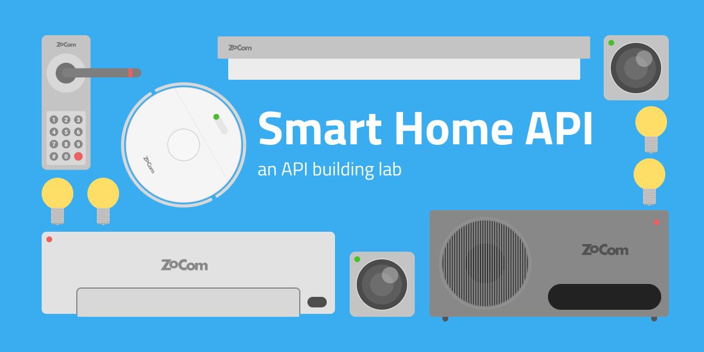

# Smart Home API Lab
**ZoCom Smart Home API is a playground to learn API design and code with [express.js](https://expressjs.com). 
Download or fork this repo and get started!**


## Control the devices
To control the different devices in the frontend, all you need to do is to update the object in the db (lowdb) and call the ```update()``` function. 

Ex.

```javascript

db
.get('devices')
.find({ id : id })
.assign({ on : true }) // Turn on the device
.value();

update(); // tell frontend to update state.

```

```javascript

db
.get('devices')
.find({ id : id })
.assign({ on : true, brightness: 0.5 }) // Turn on the device and change brightness
.value();

update(); // tell frontend to update state.

```

Changes in the db are *synchronous*.

## Models
You can also view all of the devies *datamodels* in the **about** section on the frontend.

### AC

```json
{
  "id": String,
  "type": "AC",
  "name": String,
  "on": Boolean,
  "temperature": Number,
  "state": String // on, off
}
```

### Blind

```json
{
  "id": String,
  "type": "Blind",
  "name": String,
  "on": Boolean,
  "state": String // up, down
}
```

### Light

```json
{
  "id": String,
  "type": "Light",
  "name": String,
  "on": Boolean,
  "color": String, // #-code
  "brightness": Number, // 0-1
  "state": String // on, off
}
```

### Vacuum 

```json
{
  "id": String,
  "type": "Vacuum",
  "name": String,
  "on": Boolean,
  "state": String // cleaning, charging, off
}
```

### Lock

```json
{
  "id": String,
  "type": "Lock",
  "name": String,
  "locked": Boolean,
  "secret": String, // UUID
  "code": Numbers // min 4 digit
}
```

### Camera

```json
{
  "id": String,
  "type": "Camera",
  "name": String,
  "on" : Boolean,
  "secret": String, // UUID
  "state" : "filming" // filming, faking
}
```

### Speaker
```json
{
  "id": String,
  "type": "Speaker",
  "name": String,
  "on" : Boolean,
  "stream": { 
    "file" : String, // .mp3, .ogg
    "name" : String
  },
  "state" : "silent" // silent, playing
}
```

## Current devices and ID

|Device type|Id|Comment|
|---|---|---|
|Vacuum|VAC1|BB8 slow cousin
|Light|LIG1|Bedroom light
|Light|LIG2|Livingroom light
|Light|LIG3|Garden light
|AC|AC1|Air conditioner
|Blind|BLI1|Blinds
|Lock|LOC1|Smart lock
|Camera|CAM1|Camera
|Speaker|SPE1|Smart speaker


## Level up
### Fjärkontroll
Gör en snygg vanilla fjärrkontroll värdig ditt smarta hem. Den ska ha UI-kontroller till samtliga prylar.


## Add more devices
You can even add more devices to expand your home by entering them ( by hand ) in the ```db/db.json``` file. Dont forget to give them a unique *ID*.

*Happy experimenting!*
